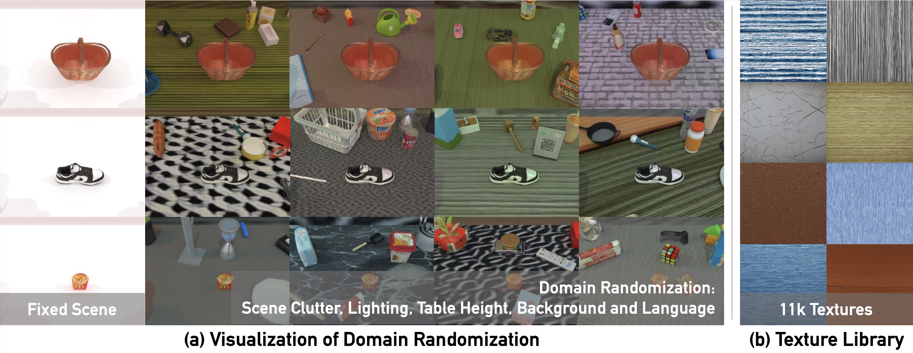

<h1 align="center">
  <a href="https://robotwin-benchmark.github.io"><b>RoboTwin</b> Bimanual Robotic Manipulation Platform<br></a>
</h1>
<h2 align="center">Lastest Version: RoboTwin 2.0<br>🤲 <a href="https://robotwin-platform.github.io/">Webpage</a> | <a href="https://robotwin-platform.github.io/doc/">Document</a> | <a href="https://arxiv.org/abs/2506.18088">Paper</a> | <a href="https://robotwin-platform.github.io/doc/community/index.html">Community</a> | <a href="https://robotwin-platform.github.io/leaderboard">Leaderboard</a></h2>

https://private-user-images.githubusercontent.com/88101805/463126988-e3ba1575-4411-4a36-ad65-f0b2f49890c3.mp4

**[2.0 Version (lastest)]** RoboTwin 2.0: A Scalable Data Generator and Benchmark with Strong Domain Randomization for Robust Bimanual Robotic Manipulation<br>
<i>Under Review 2025</i>: [Webpage](https://robotwin-platform.github.io/) | [Document](https://robotwin-platform.github.io/doc) | [PDF](https://arxiv.org/pdf/2506.18088) | [arXiv](https://arxiv.org/abs/2506.18088) | [Talk (in Chinese)](https://www.bilibili.com/video/BV18p3izYE63/?spm_id_from=333.337.search-card.all.click) | [机器之心](https://mp.weixin.qq.com/s/SwORezmol2Qd9YdrGYchEA) | [Leaderboard](https://robotwin-platform.github.io/leaderboard)<br>
> <a href="https://tianxingchen.github.io/">Tianxing Chen</a><sup>\*</sup>, Zanxin Chen<sup>\*</sup>, Baijun Chen<sup>\*</sup>, Zijian Cai<sup>\*</sup>, <a href="https://10-oasis-01.github.io">Yibin Liu</a><sup>\*</sup>, <a href="https://kolakivy.github.io/">Qiwei Liang</a>, Zixuan Li, Xianliang Lin, <a href="https://geyiheng.github.io">Yiheng Ge</a>, Zhenyu Gu, Weiliang Deng, Yubin Guo, Tian Nian, Xuanbing Xie, <a href="https://www.linkedin.com/in/yusen-qin-5b23345b/">Qiangyu Chen</a>, Kailun Su, Tianling Xu, <a href="http://luoping.me/">Guodong Liu</a>, <a href="https://aaron617.github.io/">Mengkang Hu</a>, <a href="https://c7w.tech/about">Huan-ang Gao</a>, Kaixuan Wang, <a href="https://liang-zx.github.io/">Zhixuan Liang</a>, <a href="https://www.linkedin.com/in/yusen-qin-5b23345b/">Yusen Qin</a>, Xiaokang Yang, <a href="http://luoping.me/">Ping Luo</a><sup>†</sup>, <a href="https://yaomarkmu.github.io/">Yao Mu</a><sup>†</sup>

**[RoboTwin Dual-Arm Collaboration Challenge@CVPR'25 MEIS Workshop]** RoboTwin Dual-Arm Collaboration Challenge Technical Report at CVPR 2025 MEIS Workshop<br>
Official Technical Report: [PDF](https://arxiv.org/pdf/2506.23351) | [arXiv](https://arxiv.org/abs/2506.23351) | [量子位](https://mp.weixin.qq.com/s/qxqs9vvvHsAJ-0hoYANYzQ)<br>

**[1.0 Version]** RoboTwin: Dual-Arm Robot Benchmark with Generative Digital Twins<br>
Accepted to <i style="color: red; display: inline;"><b>CVPR 2025 (Highlight)</b></i>: [PDF](https://arxiv.org/pdf/2504.13059) | [arXiv](https://arxiv.org/abs/2504.13059)<br>
> <a href="https://yaomarkmu.github.io/">Yao Mu</a><sup>* †</sup>, <a href="https://tianxingchen.github.io">Tianxing Chen</a><sup>* </sup>, Zanxin Chen<sup>* </sup>, <a href="https://shijiapeng03.github.io">Shijia Peng</a><sup>* </sup>, Zhiqian Lan, Zeyu Gao, Zhixuan Liang, Qiaojun Yu, Yude Zou, Mingkun Xu, Lunkai Lin, Zhiqiang Xie, Mingyu Ding, <a href="http://luoping.me/">Ping Luo</a><sup>†</sup>.

**[Early Version]** RoboTwin: Dual-Arm Robot Benchmark with Generative Digital Twins (early version)<br>
Accepted to <i style="color: red; display: inline;"><b>ECCV Workshop 2024 (Best Paper Award)</b></i>: [PDF](https://arxiv.org/pdf/2409.02920) | [arXiv](https://arxiv.org/abs/2409.02920)<br>
> <a href="https://yaomarkmu.github.io/">Yao Mu</a><sup>* †</sup>, <a href="https://tianxingchen.github.io">Tianxing Chen</a><sup>* </sup>, Shijia Peng<sup>*</sup>, Zanxin Chen<sup>*</sup>, Zeyu Gao, Zhiqian Lan, Yude Zou, Lunkai Lin, Zhiqiang Xie, <a href="http://luoping.me/">Ping Luo</a><sup>†</sup>.


# 📚 Overview

| Branch Name | Link |
|-------------|------|
| 2.0 Version Branch | [main](https://github.com/RoboTwin-Platform/RoboTwin/tree/main) (latest) |
| 1.0 Version Branch | [1.0 Version](https://github.com/RoboTwin-Platform/RoboTwin/tree/RoboTwin-1.0) |
| 1.0 Version Code Generation Branch | [1.0 Version GPT](https://github.com/RoboTwin-Platform/RoboTwin/tree/gpt) |
| Early Version Branch | [Early Version](https://github.com/RoboTwin-Platform/RoboTwin/tree/early_version) |
| 第十九届“挑战杯”人工智能专项赛分支 | [Challenge-Cup-2025](https://github.com/RoboTwin-Platform/RoboTwin/tree/Challenge-Cup-2025) |
| CVPR 2025 Challenge Round 1 Branch | [CVPR-Challenge-2025-Round1](https://github.com/RoboTwin-Platform/RoboTwin/tree/CVPR-Challenge-2025-Round1) |
| CVPR 2025 Challenge Round 2 Branch | [CVPR-Challenge-2025-Round2](https://github.com/RoboTwin-Platform/RoboTwin/tree/CVPR-Challenge-2025-Round2) |


# 🐣 Update
* **2025/08/28**, We update the RoboTwin 2.0 Paper [PDF](https://arxiv.org/pdf/2506.18088).
* **2025/08/25**, We fix ACT deployment code and update the [leaderboard](https://robotwin-platform.github.io/leaderboard).
* **2025/08/06**, We release RoboTwin 2.0 Leaderboard: [leaderboard website](https://robotwin-platform.github.io/leaderboard).
* **2025/07/23**, RoboTwin 2.0 received Outstanding Poster at ChinaSI 2025 (Ranking 1st).
* **2025/07/19**, We Fix DP3 evaluation code error. We will update RoboTwin 2.0 paper next week.
* **2025/07/09**, We update endpose control mode, please see [[RoboTwin Doc - Usage - Control Robot](https://robotwin-platform.github.io/doc/usage/control-robot.html)] for more details.
* **2025/07/08**, We upload [Challenge-Cup-2025](https://github.com/RoboTwin-Platform/RoboTwin/tree/Challenge-Cup-2025) Branch (第十九届挑战杯分支).
* **2025/07/02**, Fix Piper Wrist Bug [[issue](https://github.com/RoboTwin-Platform/RoboTwin/issues/104)]. Please redownload the embodiment asset.
* **2025/07/01**, We release Technical Report of RoboTwin Dual-Arm Collaboration Challenge @ CVPR 2025 MEIS Workshop [[arXiv](https://arxiv.org/abs/2506.23351)] !
* **2025/06/21**, We release RoboTwin 2.0 [[Webpage](https://robotwin-platform.github.io/)] !
* **2025/04/11**, RoboTwin is seclected as <i>CVPR Highlight paper</i>!
* **2025/02/27**, RoboTwin is accepted to <i>CVPR 2025</i> ! 
* **2024/09/30**, RoboTwin (Early Version) received <i>the Best Paper Award  at the ECCV Workshop</i>!
* **2024/09/20**, Officially released RoboTwin.

# 🛠️ Installation

See [RoboTwin 2.0 Document (Usage - Install & Download)](https://robotwin-platform.github.io/doc/usage/robotwin-install.html) for installation instructions. It takes about 20 minutes for installation.

# 🤷‍♂️ Tasks Informations
See [RoboTwin 2.0 Tasks Doc](https://robotwin-platform.github.io/doc/tasks/index.html) for more details.

<p align="center">
  
</p>

# 🧑🏻‍💻 Usage 

## Document

> Please Refer to [RoboTwin 2.0 Document (Usage)](https://robotwin-platform.github.io/doc/usage/index.html) for more details.

## Data Collection
We provide over 100,000 pre-collected trajectories as part of the open-source release [RoboTwin Dataset](https://huggingface.co/datasets/TianxingChen/RoboTwin2.0/tree/main/dataset).
However, we strongly recommend users to perform data collection themselves due to the high configurability and diversity of task and embodiment setups.



## 1. Task Running and Data Collection
Running the following command will first search for a random seed for the target collection quantity, and then replay the seed to collect data.

```
bash collect_data.sh ${task_name} ${task_config} ${gpu_id}
# Example: bash collect_data.sh beat_block_hammer demo_randomized 0
```

## 2. Modify Task Config
☝️ See [RoboTwin 2.0 Tasks Configurations Doc](https://robotwin-platform.github.io/doc/usage/configurations.html) for more details.

## 3. Subtask (Atomic Action) Labeling
A task can label every atomic action of its demonstration, so that the action being
executed is known for every frame of the episode. The whole episode is still collected
and still gets its own instruction, the labels are stored on top of it.

Annotate `play_once` with `self.subtask(action, info)`, where `action` selects the
instruction templates and `info` provides their placeholder values (see
`envs/stack_blocks_three.py`):

```python
def pick_and_place_block(self, block):
    arm_tag = ArmTag("left" if block.get_pose().p[0] < 0 else "right")

    with self.subtask("pick", {"{A}": block.name, "{a}": str(arm_tag)}):
        self.move(self.grasp_actor(block, arm_tag=arm_tag, pre_grasp_dis=0.09))
        self.move(self.move_by_displacement(arm_tag=arm_tag, z=0.07))

    with self.subtask("place", {"{A}": block.name, "{B}": target_name, "{a}": str(arm_tag)}):
        self.move(self.place_actor(block, target_pose=target_pose, arm_tag=arm_tag))
```

`bash collect_data.sh ...` then additionally writes, per episode:

| File | Content |
| --- | --- |
| `data/${task_name}/${task_config}/subtasks/episode${i}.json` | the key frames, i.e. the `[start_frame, end_frame)` of every atomic action and its parameters |
| `data/${task_name}/${task_config}/instructions/episode${i}_subtasks.json` | the same segments plus the `seen` / `unseen` language instructions of each atomic action |

The frame indices refer to the frames of `data/episode${i}.hdf5`, they cover the whole
episode without gaps.

The instructions are filled from `description/subtask_instruction/_default.json`, which
holds templates for the common atomic actions (pick, place, move, push, ...). Add
`description/subtask_instruction/${task_name}.json` to override them for a task. They
can be regenerated without recollecting the data with:

```
cd description && bash gen_subtask_instructions.sh ${task_name} ${task_config} ${language_num}
```

To train on the atomic actions, `policy/pi05/scripts/process_data.py` carries the key
frames into each processed episode and
`policy/pi05/examples/kuka/convert_kuka_data_to_lerobot_robotwin.py` uses them to label
each frame with the instruction of its atomic action (`--subtasks`, the default), or to
emit one LeRobot episode per atomic action (`--split-subtask-episodes`).

# 🚴‍♂️ Policy Baselines
## Policies Support
[DP](https://robotwin-platform.github.io/doc/usage/DP.html), [ACT](https://robotwin-platform.github.io/doc/usage/ACT.html), [DP3](https://robotwin-platform.github.io/doc/usage/DP3.html), [RDT](https://robotwin-platform.github.io/doc/usage/RDT.html), [PI0](https://robotwin-platform.github.io/doc/usage/Pi0.html), [OpenVLA-oft](https://robotwin-platform.github.io/doc/usage/OpenVLA-oft.html)

[TinyVLA](https://robotwin-platform.github.io/doc/usage/TinyVLA.html), [DexVLA](https://robotwin-platform.github.io/doc/usage/DexVLA.html) (Contributed by Media Group)

[LLaVA-VLA](https://robotwin-platform.github.io/doc/usage/LLaVA-VLA.html) (Contributed by IRPN Lab, HKUST(GZ))

[GO-1](https://robotwin-platform.github.io/doc/usage/GO1.html) (Contributed by GO-1 Team)

Deploy Your Policy: [Guidance](https://robotwin-platform.github.io/doc/usage/deploy-your-policy.html)

⏰ TODO: G3Flow, HybridVLA, SmolVLA, AVR, UniVLA

# 🏄‍♂️ Experiment & LeaderBoard

> We recommend that the RoboTwin Platform can be used to explore the following topics: 
> 1. single - task fine - tuning capability
> 2. visual robustness
> 3. language diversity robustness (language condition)
> 4. multi-tasks capability
> 5. cross-embodiment performance

The full leaderboard and setting can be found in: [https://robotwin-platform.github.io/leaderboard](https://robotwin-platform.github.io/leaderboard).

# 💽 Pre-collected Large-scale Dataset

Please refer to [RoboTwin 2.0 Dataset - Huggingface](https://huggingface.co/datasets/TianxingChen/RoboTwin2.0/tree/main/dataset).

# 👍 Citations
If you find our work useful, please consider citing:

<b>RoboTwin 2.0</b>: A Scalable Data Generator and Benchmark with Strong Domain Randomization for Robust Bimanual Robotic Manipulation
```
@article{chen2025robotwin,
  title={Robotwin 2.0: A scalable data generator and benchmark with strong domain randomization for robust bimanual robotic manipulation},
  author={Chen, Tianxing and Chen, Zanxin and Chen, Baijun and Cai, Zijian and Liu, Yibin and Li, Zixuan and Liang, Qiwei and Lin, Xianliang and Ge, Yiheng and Gu, Zhenyu and others},
  journal={arXiv preprint arXiv:2506.18088},
  year={2025}
}
```

<b>RoboTwin</b>: Dual-Arm Robot Benchmark with Generative Digital Twins, accepted to <i style="color: red; display: inline;"><b>CVPR 2025 (Highlight)</b></i>
```
@InProceedings{Mu_2025_CVPR,
    author    = {Mu, Yao and Chen, Tianxing and Chen, Zanxin and Peng, Shijia and Lan, Zhiqian and Gao, Zeyu and Liang, Zhixuan and Yu, Qiaojun and Zou, Yude and Xu, Mingkun and Lin, Lunkai and Xie, Zhiqiang and Ding, Mingyu and Luo, Ping},
    title     = {RoboTwin: Dual-Arm Robot Benchmark with Generative Digital Twins},
    booktitle = {Proceedings of the Computer Vision and Pattern Recognition Conference (CVPR)},
    month     = {June},
    year      = {2025},
    pages     = {27649-27660}
}
```

Benchmarking Generalizable Bimanual Manipulation: RoboTwin Dual-Arm Collaboration Challenge at CVPR 2025 MEIS Workshop
```
@article{chen2025benchmarking,
  title={Benchmarking Generalizable Bimanual Manipulation: RoboTwin Dual-Arm Collaboration Challenge at CVPR 2025 MEIS Workshop},
  author={Chen, Tianxing and Wang, Kaixuan and Yang, Zhaohui and Zhang, Yuhao and Chen, Zanxin and Chen, Baijun and Dong, Wanxi and Liu, Ziyuan and Chen, Dong and Yang, Tianshuo and others},
  journal={arXiv preprint arXiv:2506.23351},
  year={2025}
}
```

<b>RoboTwin</b>: Dual-Arm Robot Benchmark with Generative Digital Twins (early version), accepted to <i style="color: red; display: inline;"><b>ECCV Workshop 2024 (Best Paper Award)</b></i>
```
@article{mu2024robotwin,
  title={RoboTwin: Dual-Arm Robot Benchmark with Generative Digital Twins (early version)},
  author={Mu, Yao and Chen, Tianxing and Peng, Shijia and Chen, Zanxin and Gao, Zeyu and Zou, Yude and Lin, Lunkai and Xie, Zhiqiang and Luo, Ping},
  journal={arXiv preprint arXiv:2409.02920},
  year={2024}
}
```

# 😺 Acknowledgement

**Software Support**: D-Robotics, **Hardware Support**: AgileX Robotics, **AIGC Support**: Deemos.

Contact [Tianxing Chen](https://tianxingchen.github.io) if you have any questions or suggestions.

# 🏷️ License
This repository is released under the MIT license. See [LICENSE](./LICENSE) for additional details.
